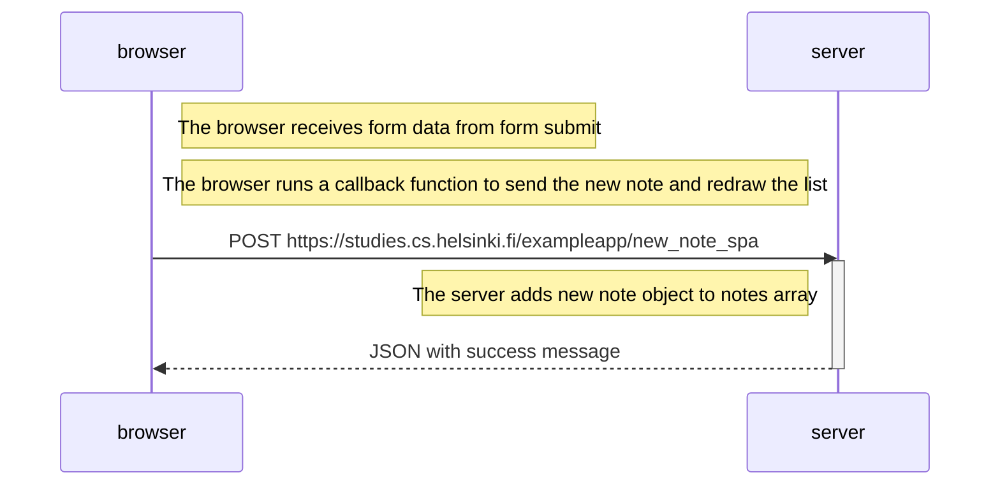

```mermaid
sequenceDiagram
    participant browser
    participant server

    Note right of browser: The browser receives form data from form submit
    Note right of browser: The browser runs a callback function to send the new note and redraw the list

    browser->>server: POST https://studies.cs.helsinki.fi/exampleapp/new_note_spa
    activate server
    Note left of server: The server adds new note object to notes array
    server-->>browser: JSON with success message
    deactivate server
```